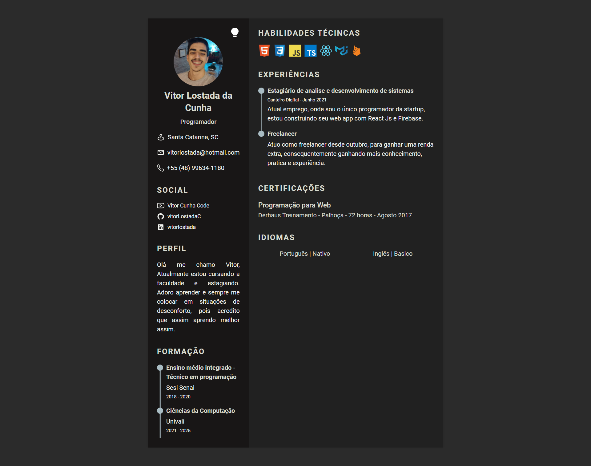

# React-JS--Digital-Curriculum-Tailwindcss

  
  

## Link

https://curriculo-tailwind.firebaseapp.com/

## Installation

  1. `$ npm install` or `$ yarn`
  2. `$ npm start` or `$ yarn start`

## Functionalities

+ Responsive design
+ Tailwind CSS
+ dark mode and light mode

